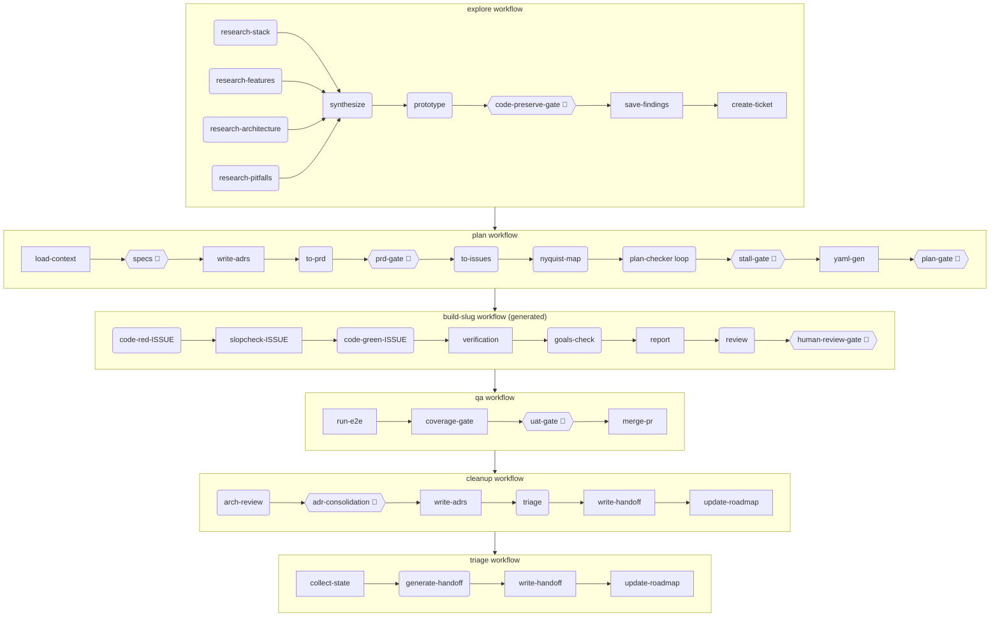

# unic-archon-dlc

> Six Archon YAML workflows covering the full AI development lifecycle — explore, plan, build, qa, cleanup, triage — with human approval gates at every phase boundary.

## Architecture



> **Legend**: `(node)` = prompt node · `[node]` = bash node · `{{node 👤}}` = interactive gate

## Node Reference

| Workflow | Node | Type | Human Gate |
|----------|------|------|-----------|
| explore | research-stack | prompt | — |
| explore | research-features | prompt | — |
| explore | research-architecture | prompt | — |
| explore | research-pitfalls | prompt | — |
| explore | synthesize | prompt | — |
| explore | prototype | prompt | — |
| explore | code-preserve-gate | prompt | ✓ |
| explore | save-findings | bash | — |
| explore | create-ticket | bash | — |
| plan | load-context | bash | — |
| plan | specs | prompt | ✓ |
| plan | write-adrs | bash | — |
| plan | to-prd | prompt | — |
| plan | prd-gate | prompt | ✓ |
| plan | to-issues | prompt | — |
| plan | nyquist-map | prompt | — |
| plan | plan-checker | loop | — |
| plan | stall-gate | prompt | ✓ |
| plan | yaml-gen | bash | — |
| plan | plan-gate | prompt | ✓ |
| build | code-red-ISSUE | prompt | — |
| build | slopcheck-ISSUE | bash | — |
| build | code-green-ISSUE | prompt | — |
| build | verification | bash | — |
| build | goals-check | prompt | — |
| build | report | bash | — |
| build | review | prompt | — |
| build | human-review-gate | prompt | ✓ |
| qa | run-e2e | bash | — |
| qa | coverage-gate | bash | — |
| qa | uat-gate | prompt | ✓ |
| qa | merge-pr | bash | — |
| cleanup | arch-review | prompt | — |
| cleanup | adr-consolidation | prompt | ✓ |
| cleanup | write-adrs | bash | — |
| cleanup | triage | prompt | — |
| cleanup | write-handoff | bash | — |
| cleanup | update-roadmap | bash | — |
| triage | collect-state | bash | — |
| triage | generate-handoff | prompt | — |
| triage | write-handoff | bash | — |
| triage | update-roadmap | bash | — |

## Quick Start

1. **Install the plugin** — add `unic-archon-dlc` to your Claude Code plugins.
2. **Run the install hook** — in your project root: `node $(claude-code plugin-root unic-archon-dlc)/scripts/install.mjs`
3. **Start your first workflow** — `archon run explore` (recommended starting point) or `archon run plan` to jump straight to planning.

## Configuration Reference

The install hook writes `.archon/unic-dlc.config.json` to your project root. All keys:

| Key | Type | Default | Valid Values | Description |
|-----|------|---------|-------------|-------------|
| `issueTracker` | string | auto-detected | `github` · `ado` · `jira` · `local` | Issue tracker backend used by tracker adapter CLI commands |
| `branchingStrategy` | string | `gitflow` | `gitflow` · `github-flow` | Git branching strategy; governs branch naming and PR targets in docs/agents/branching.md |
| `tddMode` | boolean | `true` | `true` · `false` | Whether build workflow enforces code-red before code-green ordering |
| `nyquistValidation` | boolean | `true` | `true` · `false` | Whether plan-checker enforces a testCommand for every issue |
| `slopsquattingGate` | boolean | `true` | `true` · `false` | Whether slopcheck nodes run before each code-green phase |
| `modelProfile` | string | `balanced` | `balanced` · `fast` · `quality` | Preferred model profile hint for prompt nodes |
| `e2eCommand` | string \| null | `null` | Any shell command | E2e test command run by qa workflow; `null` skips the e2e step with a warning |
| `labels.state` | object | (see below) | key→value map | Maps canonical state labels to tracker-specific names |
| `labels.type` | object | (see below) | key→value map | Maps canonical type labels (feature, bug) to tracker-specific names |
| `labels.priority` | object | (see below) | key→value map | Maps canonical priority labels (p0–p3) to tracker-specific names |

### Canonical label names

**State**: `needs-triage`, `needs-info`, `needs-specs`, `ready-for-agent`, `ready-for-human`, `resolved`, `closed`, `rejected`

**Type**: `feature`, `bug`

**Priority**: `p0` (critical), `p1` (high), `p2` (medium), `p3` (low)

## docs/workflow/ Layout

```
docs/workflow/
├── HANDOFF.md                      # Latest triage snapshot (Archon-written)
├── ROADMAP.md                      # Dated status log per feature (Archon-appended)
└── <slug>/                         # One directory per feature
    ├── findings.md                 # Explore workflow output (Archon-written)
    ├── PRD.md                      # Plan workflow output (Archon-written)
    ├── issues.json                 # Issue decomposition with blocked_by arrays (Archon-written)
    ├── report.md                   # Build workflow summary (Archon-written)
    └── arch-review.md              # Cleanup workflow arch review (Archon-written)

.archon/
├── unic-dlc.config.json            # Plugin config (install hook-written, developer-editable)
└── workflows/
    ├── explore.yaml                # Plugin-shipped workflow
    ├── plan.yaml                   # Plugin-shipped workflow
    ├── build-template.yaml         # Annotated reference template (never executed directly)
    ├── qa.yaml                     # Plugin-shipped workflow
    ├── cleanup.yaml                # Plugin-shipped workflow
    ├── triage.yaml                 # Plugin-shipped workflow
    └── build-<slug>.yaml           # Generated at plan time by yaml-gen node (Archon-written)

docs/agents/                        # Human-readable agent context (install hook-written)
├── issue-tracker.md
├── labels.md
├── branching.md
├── domain.md
└── workflow.md
```

**Ownership key**: _Archon-written_ = created/updated by workflow nodes at runtime · _Plugin-shipped_ = included in this plugin · _Developer-editable_ = meant to be read and optionally edited by the developer

## Dependencies

- **Archon**: Required. The install hook verifies `archon` is on `PATH` and exits with a clear error if not found. Minimum version: any release that supports `interactive: true` nodes and `loop` type nodes.
- **No peer Claude Code plugins required**: The `.archon/commands/review.md` command is self-contained and does not depend on `pr-review-toolkit` or any other plugin.
- **No external runtime npm dependencies**: All scripts use only Node.js built-ins (`node:fs`, `node:path`, `node:os`, `node:child_process`, `node:readline`).
