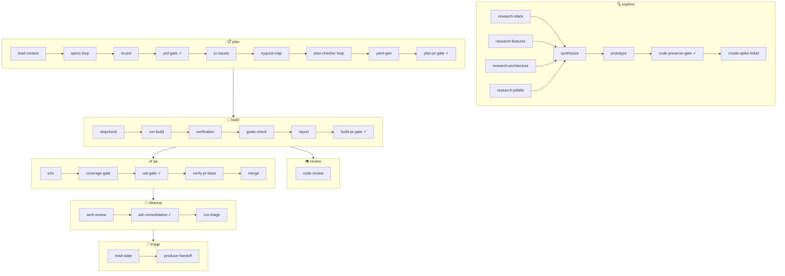

# unic-archon-dlc

A complete Archon-powered AI development lifecycle as an installable DLC pack — six workflow DAGs
covering explore, plan, build, qa, cleanup, and triage with human approval gates at every
decision boundary.

Archon has no marketplace; this plugin rides the Claude Code plugin marketplace and scaffolds all
six workflows plus agent-skill docs into the target project during install.

---

## Workflows



> **✓** = interactive human gate (workflow pauses until human approves or rejects)

---

## Node reference

| Workflow | Node                  | Type        | Human gate |
| -------- | --------------------- | ----------- | ---------- |
| explore  | research-stack        | prompt      | —          |
| explore  | research-features     | prompt      | —          |
| explore  | research-architecture | prompt      | —          |
| explore  | research-pitfalls     | prompt      | —          |
| explore  | synthesize            | prompt      | —          |
| explore  | prototype             | prompt      | —          |
| explore  | code-preserve-gate    | interactive | ✓          |
| explore  | create-spike-ticket   | prompt      | —          |
| plan     | load-context          | prompt      | —          |
| plan     | specs                 | loop        | —          |
| plan     | to-prd                | prompt      | —          |
| plan     | prd-gate              | interactive | ✓          |
| plan     | to-issues             | prompt      | —          |
| plan     | nyquist-map           | prompt      | —          |
| plan     | plan-checker          | loop        | —          |
| plan     | yaml-gen              | bash        | —          |
| plan     | plan-pr-gate          | interactive | ✓          |
| build    | slopcheck             | bash        | —          |
| build    | run-build             | prompt      | —          |
| build    | verification          | bash        | —          |
| build    | goals-check           | prompt      | —          |
| build    | report                | prompt      | —          |
| build    | build-pr-gate         | interactive | ✓          |
| review   | code-review           | prompt      | —          |
| qa       | e2e                   | bash        | —          |
| qa       | coverage-gate         | bash        | —          |
| qa       | uat-gate              | interactive | ✓          |
| qa       | verify-pr-base        | bash        | —          |
| qa       | merge                 | bash        | —          |
| cleanup  | arch-review           | prompt      | —          |
| cleanup  | adr-consolidation     | interactive | ✓          |

---

## Dependencies

Beyond the Archon workflow engine (see [Configuration reference](#configuration-reference)), the interactive boxes (`/specs`,
`/tickets`, `/triage`, …) **compose [Matt Pocock's engineering skill _methods_](https://github.com/mattpocock/skills)**
as a declared dependency — they don't reimplement them. Install the skill suite so the following are
available to Claude Code (typically under `.agents/skills/`):

| Skill method      | Composed by         |
| ----------------- | ------------------- |
| `grill-with-docs` | `/specs`            |
| `to-prd`          | `/specs`            |
| `to-issues`       | `/tickets`          |
| `triage`          | `/triage`           |
| `grilling`        | `/specs`, `/triage` |
| `domain-modeling` | `/specs`, `/triage` |

`/unic-archon-dlc:setup` **verifies the suite is present** and warns (non-blocking) if any method is
missing — quality degrades but the boxes still run.

> **Do _not_ run Matt's `setup-matt-pocock-skills`.** That skill writes its own tracker/label config
> (`docs/agents/triage-labels.md`, `docs/agents/issue-tracker.md`). The DLC deliberately does not use
> it: `/unic-archon-dlc:setup` is the **single** config source, and each box injects that config into
> Matt's methods at invocation. Running both setups would create a second label file that can drift
> from `.archon/unic-dlc.config.yaml` (what `/tickets` and `/build` read). Only Matt's skill
> _methods_ are a dependency — never his setup. See [ADR-0024](docs/adr/0024-triage-intake-on-ramp.md).

---

## Quick start

**Step 1 — Configure**

Open Claude Code in any project and run:

```
/unic-archon-dlc:setup
```

The setup command auto-detects your tracker (GitHub, ADO, Jira, or local-markdown), deduces a
PR strategy, and writes all agent docs and workflow files into your project.

**Step 2 — Explore**

Kick off research on any new problem space:

```
/unic-dlc-explore my-feature
```

**Step 3 — Triage**

Turn raw incoming work (a bug report, feature request, QA finding, or external PR) into an
agent-ready issue on your tracker — the intake on-ramp into the backlog:

```
/unic-archon-dlc:triage 42
/unic-archon-dlc:triage "what needs my attention"
```

`/triage` is a thin wrapper over Matt Pocock's `triage` method, bound to your DLC config as the
single source of truth for labels (see [Dependencies](#dependencies)). A `ready-for-agent` issue
flows into `/tickets` next.

---

## Configuration reference

The `/unic-archon-dlc:setup` command writes the rich `.archon/unic-dlc.config.yaml` ([ADR-0018](docs/adr/0018-generic-core-config-compose.md), [ADR-0019](docs/adr/0019-conversational-setup.md)). It is the config substrate the **redesigned** boxes read; setup is its sole writer, is idempotent (a re-run merges, never clobbers — a present-but-malformed config fails fast rather than being overwritten), and reads any legacy `.archon/unic-dlc.config.json` to migrate it (the old file is left in place). The pre-redesign workflows under `.archon/workflows/` still read the old JSON schema and are migrated onto this file box by box in later redesign steps. Top-level sections:

| Path                                                     | Default            | Valid values                                  | Description                                                                                                                         |
| -------------------------------------------------------- | ------------------ | --------------------------------------------- | ----------------------------------------------------------------------------------------------------------------------------------- |
| `project.name`                                           | asked              | any string                                    | Project name                                                                                                                        |
| `project.repo_layout`                                    | auto-detected      | `single-context` · `multi-context`            | Whether `CONTEXT-MAP.md` is present                                                                                                 |
| `project.branching`                                      | asked              | `gitflow` · `github-flow`                     | Branching model (mandatory)                                                                                                         |
| `project.pr_strategy`                                    | asked              | `squash` · `merge` · `rebase`                 | PR merge strategy (mandatory)                                                                                                       |
| `tracker.type`                                           | auto-detected      | `github` · `ado` · `jira` · `local-markdown`  | Issue tracker backend (mandatory)                                                                                                   |
| `tracker.access`                                         | discovered         | `{ mcp, cli }`                                | Capability→tool for the tracker (MCP-first, CLI-fallback)                                                                           |
| `tracker.coords`                                         | asked              | tracker-specific map                          | e.g. `{ owner, repo }` (github) / `{ org, project, repo }` (ado)                                                                    |
| `docs.type`                                              | `markdown`         | `confluence` · `markdown` · `none`            | Where the team's product specs live (drives `/specs` publishing)                                                                    |
| `docs.publish`                                           | `false`            | `true` · `false`                              | Opt-in publishing of the PRD to the docs system                                                                                     |
| `design.type`                                            | `none`             | `figma` · `none`                              | Design system source                                                                                                                |
| `templates.prd`                                          | 7-section scaffold | template string                               | Config-driven PRD template `/specs` fills (ADR-0018); override to change PRD shape                                                  |
| `templates.{issue,bug}`                                  | `null`             | template string                               | Config-driven artifact templates (ADR-0018)                                                                                         |
| `classification.labels.*`                                | canonical          | any string                                    | 3-tier label mapping (state · type · priority)                                                                                      |
| `specs.discuss_mode`                                     | `discuss`          | `discuss` · `assumptions`                     | `/specs` grilling style: `discuss` composes `/grill-with-docs`; `assumptions` enumerates upfront (ADR-0020)                         |
| `specs.gate`                                             | `open-pr`          | `open-pr` · `stage-only`                      | `/specs` PRD gate: `open-pr` commits + opens a PR to `develop` (never merged); `stage-only` stages and stops                        |
| `tickets.gate`                                           | `open-pr`          | `open-pr` · `stage-only`                      | `/tickets` gate: `open-pr` commits `issues.json` + opens a PR to `develop` (never merged); `stage-only` stages and stops (ADR-0022) |
| `triage.out_of_scope_dir`                                | `.out-of-scope`    | dir name                                      | Where `/triage` records rejected enhancements (the out-of-scope KB) (ADR-0024)                                                      |
| `triage.external_prs`                                    | `auto`             | `auto` · `always` · `never`                   | Whether `/triage` treats external PRs as a request surface; `auto` = infer from `tracker.type` (github→yes) (ADR-0024)              |
| `gates.{build,qa,pr-review,explore}`                     | `hitl`             | `hitl` · `afk`                                | Per-Archon-box gate mode (ADR-0017); interactive boxes are HITL                                                                     |
| `build.fresh_context_red_green`                          | `true`             | `true` · `false`                              | Anti-cheat fresh-context red/green separation (ADR-0012)                                                                            |
| `build.{tdd_mode,nyquist_validation,slopsquatting_gate}` | `true`             | `true` · `false`                              | Build discipline toggles                                                                                                            |
| `build.e2e_command`                                      | `null`             | shell command string                          | Full e2e suite command                                                                                                              |
| `build.coverage_threshold`                               | `null`             | number (0–100) or `null`                      | Minimum % coverage; `null` skips the check                                                                                          |
| `estimations`                                            | `off`              | `off` · `provisional` · `definitive` · `both` | Estimation waves (ADR-0020)                                                                                                         |
| `artifacts_dir`                                          | `workflows`        | dir name                                      | Session artifact home base (`<artifacts_dir>/<slug>/`)                                                                              |
| `model_profile`                                          | `balanced`         | `fast` · `balanced` · `max`                   | Model tier for workflow nodes                                                                                                       |
| `skills.matt_suite`                                      | discovered         | `{ present, missing }`                        | Verify-only discovery result for Matt Pocock's declared skill suite                                                                 |

Label canonical names: states `needs-triage` · `needs-info` · `needs-specs` · `ready-for-agent` ·
`ready-for-human` · `resolved` · `closed` · `rejected`; types `feature` · `bug` · `spike` ·
`tech-debt` · `docs`; priorities `p0` · `p1` · `p2` · `p3`.

---

## docs/workflow/ layout

The DLC creates three layers of persistent artefacts:

```
docs/
└── workflow/
    ├── ROADMAP.md                   # 3️⃣  Persistent — human + auto-generated (marker-delimited)
    ├── HANDOFF.md                   # 3️⃣  Persistent — refreshed by every triage run
    └── <slug>/
        ├── findings.md              # 2️⃣  Session — explore output (stack, features, pitfalls, brief)
        ├── PRD.md                   # 2️⃣  Session — plan output (7 mandatory sections)
        ├── issues.json              # 2️⃣  Session — decomposed vertical slices + test commands
        ├── plan-checker-report.md   # 2️⃣  Session — plan validation results
        ├── report.md                # 2️⃣  Session — build outcomes (5 sections)
        └── arch-review.md           # 2️⃣  Session — cleanup drift analysis

.archon/
└── workflows/
    └── build-<slug>.yaml            # 1️⃣  Transient — auto-generated by yaml-gen, re-generated each plan
```

**Three-layer separation:**

| Layer         | Location                                 | Owner     | Lifecycle                                             |
| ------------- | ---------------------------------------- | --------- | ----------------------------------------------------- |
| 1️⃣ Transient  | `.archon/workflows/build-*.yaml`         | yaml-gen  | Re-generated each plan cycle; safe to delete          |
| 2️⃣ Session    | `docs/workflow/<slug>/`                  | DLC nodes | Scoped to one planning session; accumulates artifacts |
| 3️⃣ Persistent | `docs/workflow/ROADMAP.md`, `HANDOFF.md` | triage    | Lives for the life of the project; human-editable     |

Human-written content in `ROADMAP.md` outside the `<!-- unic-archon-dlc:begin/end -->` markers is
never overwritten.

---

## Dependency map

- **Archon**: version ≥ 0.10 required (supports `type: loop`, `type: bash`, `fresh_context: true`)
- **Required peer plugins**: none
- **Optional tool**: Python `slopcheck` CLI (GSD's slopsquatting gate) — if on `PATH`, the
  slopcheck node defers to it; otherwise falls back to npm registry HEAD checks
- **Tracker CLIs** (install the one matching your config):
  - GitHub: `gh` (GitHub CLI)
  - Azure DevOps: `az` (Azure CLI with `azure-devops` extension)
  - Jira: `jira` (go-jira or Atlassian CLI)
  - local-markdown: no CLI needed
