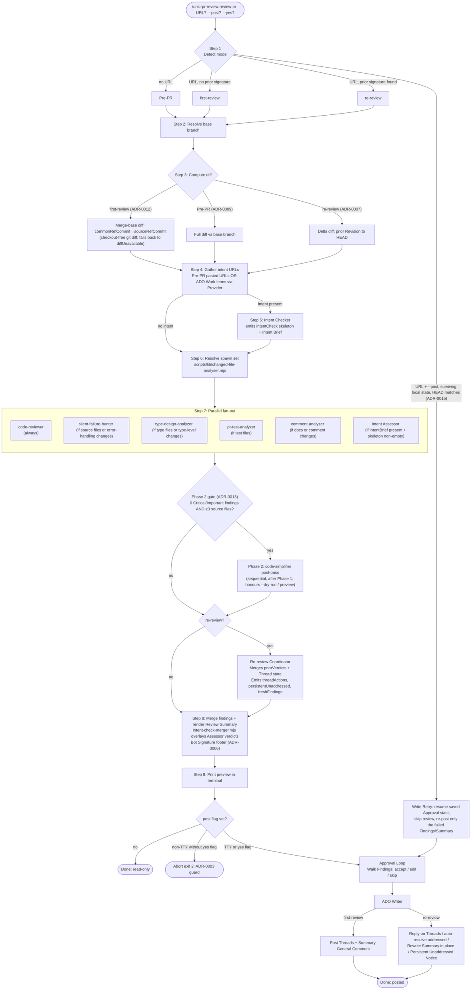

# unic-pr-review

AI-powered PR review with intent checking against Azure Boards and Jira Work Items, Confidence-scored Findings, and an interactive Approval Loop.

This plugin is the v2 successor to `pr-review`. It is built from scratch against its own PRD and ADRs; it does not share code, prompts, or fixtures with the v1 plugin.

## Prerequisites

- Node.js ≥ 22 (the Plugin uses built-in `node:https` / global `fetch`)
- Azure CLI (`az`) on `PATH` — <https://learn.microsoft.com/en-us/cli/azure/install-azure-cli>
- The `azure-devops` Azure CLI extension: `az extension add --name azure-devops`
- A valid Azure DevOps session: `az devops login --org <your-org-url>`
- An Atlassian Cloud API token for Confluence (and optionally Jira) — <https://id.atlassian.com/manage-profile/security/api-tokens>

## Installation

Add the plugin to your `enabledPlugins` in `settings.json`:

```json
{
  "enabledPlugins": {
    "unic-pr-review@unic": true
  }
}
```

Then reinstall plugins from the Claude Code command palette.

## Quick start

1. Run the doctor command first to verify your environment:

   ```text
   /unic-pr-review:doctor
   ```

   It runs all prerequisite checks and tells you exactly what is missing before any Review is attempted.

2. Once doctor is green, run a review of your local branch (Pre-PR mode):

   ```text
   /unic-pr-review:review-pr
   ```

   With no argument the command reviews your local branch against its resolved upstream base branch and prints the Review Summary in the terminal (Pre-PR mode).

   To review an open Azure DevOps PR, pass the PR URL:

   ```text
   /unic-pr-review:review-pr https://dev.azure.com/myorg/myproj/_git/myrepo/pullrequest/42
   ```

   This runs the ADO first-review flow (read-only preview): fetches PR metadata, Revisions, Threads, and Work Items via the Azure DevOps CLI, then fans out to the Review Aspect agents and prints the merged Review Summary. Nothing is written to ADO. If you run from inside a local clone of the PR's repository, the Plugin computes a checkout-free line-level diff (merge base to source branch) and passes it to the Review Aspect agents; if no matching clone is detected the Plugin falls back to file-list-only mode (see [ADR-0012](docs/adr/0012-checkout-free-first-review-diff.md)).

   To review an open Azure DevOps PR and write Findings back, pass the PR URL with `--post`:

   ```text
   /unic-pr-review:review-pr https://dev.azure.com/myorg/myproj/_git/myrepo/pullrequest/42 --post
   ```

   Omit `--post` for a read-only terminal preview; add `--yes` to bulk-accept all Findings without prompting.

## How it works

The `review-pr` command runs the orchestrator in [`commands/review-pr.md`](commands/review-pr.md) through nine steps. The Intent Assessor and Re-review Coordinator are dedicated agents — not Review Aspects — spawned by mode/intent presence, never by changed-file categories ([ADR-0008](docs/adr/0008-conditional-sub-agent-spawning.md), [ADR-0011](docs/adr/0011-intent-assessor-for-live-ac-verdicts.md)).



Read-only by default. The `--post` path writes only what you accept in the Approval Loop. Bot Signature detection lets the next run recognise its own prior work and increment the Iteration ([ADR-0006](docs/adr/0006-iteration-state-in-pr.md)); if a `--post` partially fails, the local state directory (`<cwd>/.unic-pr-review/<key>/`) lets a re-run on the same machine finish the partial Iteration instead of starting a new one ([ADR-0015](docs/adr/0015-write-retry-completes-partial-iteration.md)).

## Commands

| Command                                    | Description                                                                                                                      | Argument hint                     |
| ------------------------------------------ | -------------------------------------------------------------------------------------------------------------------------------- | --------------------------------- |
| `/unic-pr-review:doctor`                   | Verify all unic-pr-review prerequisites are in place                                                                             | _(no arguments)_                  |
| `/unic-pr-review:review-pr [<ADO PR URL>]` | Review your local branch (Pre-PR mode) or an Azure DevOps PR. Add `--post` to enter the Approval Loop and write Findings to ADO. | `[<ADO PR URL>] [--post] [--yes]` |
| `/unic-pr-review:setup-confluence`         | Interactive wizard — writes `~/.unic-confluence.json`                                                                            | _(no arguments)_                  |
| `/unic-pr-review:setup-jira`               | Interactive wizard — adds `jiraUrl` to `~/.unic-confluence.json`                                                                 | _(no arguments)_                  |
| `/unic-pr-review:setup-azure`              | Interactive wizard — writes `~/.unic-azure.json`                                                                                 | _(no arguments)_                  |

## Credential files

The Plugin reads two optional JSON files from your home directory. Both must be chmod 600 on Unix.

### `~/.unic-confluence.json`

Shared by Confluence and Jira (ADR-0001):

```json
{
  "url": "https://uniccom.atlassian.net",
  "username": "you@unic.com",
  "token": "ATATT-...your-API-token...",
  "jiraUrl": "https://uniccom.atlassian.net"
}
```

The `jiraUrl` field is optional. If absent, doctor stays silent about Jira (US 35) and Reviews skip Jira fetching.

### `~/.unic-azure.json`

Holds your Azure DevOps credentials. When you pass a PR URL, `review-pr` derives the org, project, repo, and PR id from the URL itself (via the provider's `parse-url`) — it does **not** read `orgUrl` from this file. The `az`-based ADO flow authenticates against your ambient `az devops login` session (ADR-0005), not the stored PAT; the PAT here is consumed by the `setup-azure` wizard and credential helpers, and is not currently wired into the review flow.

```json
{
  "orgUrl": "https://dev.azure.com/your-org",
  "pat": "your-personal-access-token"
}
```

## Environment variable overrides

Every credential field can be overridden at run time, which is useful in CI where writing to `$HOME` is undesirable. Env vars take precedence over the credential files.

| Variable               | Overrides                               |
| ---------------------- | --------------------------------------- |
| `CONFLUENCE_URL`       | `url` in `~/.unic-confluence.json`      |
| `CONFLUENCE_USER`      | `username` in `~/.unic-confluence.json` |
| `CONFLUENCE_TOKEN`     | `token` in `~/.unic-confluence.json`    |
| `JIRA_URL`             | `jiraUrl` in `~/.unic-confluence.json`  |
| `AZURE_DEVOPS_ORG_URL` | `orgUrl` in `~/.unic-azure.json`        |
| `AZURE_DEVOPS_PAT`     | `pat` in `~/.unic-azure.json`           |

If `CONFLUENCE_URL`, `CONFLUENCE_USER`, and `CONFLUENCE_TOKEN` are all set, the credential file is not read at all.

## Version history

See [CHANGELOG.md](./CHANGELOG.md).
