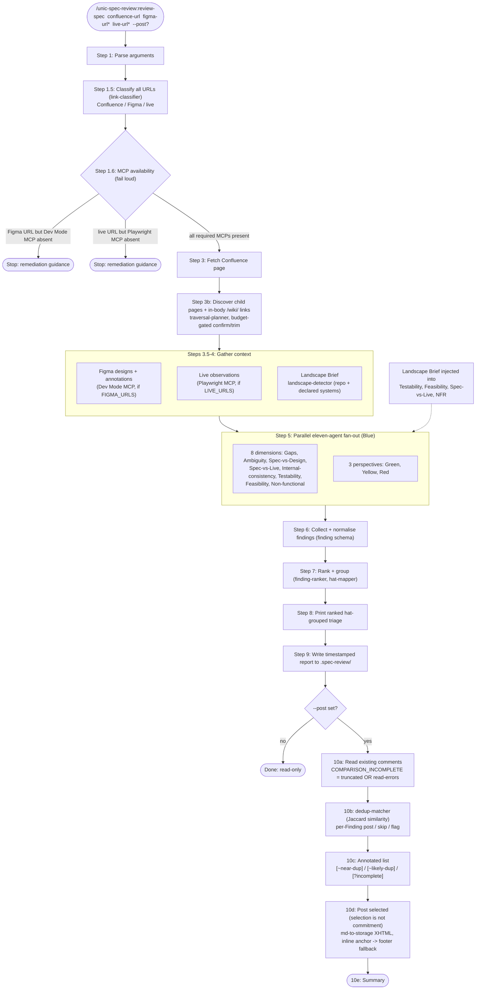

# unic-spec-review

A Claude Code plugin for **adversarial review of web specifications**. Given Confluence spec pages (parent plus children), Figma designs, and the live production system, it runs a parallel eleven-agent review (eight technical dimensions plus Green/Yellow/Red perspective lenses from the Six Thinking Hats) and produces Confidence-scored, hat-tagged Findings.

Findings are presented for triage first. With `--post`, an interactive Approval Loop lets you select which Findings to publish as Confluence comments (inline-anchored where possible, page-level footer fallback), with content-similarity de-duplication against existing comments so repeated runs by multiple reviewers do not pile up duplicates.

The plugin is fully self-contained: it ships its own `/setup-confluence` wizard and vendored credential handling, so it can be installed and used without any other plugin. It stores credentials in `~/.unic-confluence.json` (the same convention `unic-pr-review` uses, or `CONFLUENCE_*` env vars), so a user with both plugins configures Confluence once. Figma access is via the Figma Dev Mode MCP; live-system access is via the Playwright MCP. Both are discovered at runtime and fail loud if a pasted link needs an MCP that is not connected.

## Prerequisites

- Node.js ≥ 22 (the plugin uses built-in `node:https` / global `fetch`; no runtime npm dependencies)
- An Atlassian Cloud API token for Confluence - <https://id.atlassian.com/manage-profile/security/api-tokens>
- _(Optional, only when reviewing Figma links)_ the **Figma Dev Mode MCP** connected in your Claude Code MCP settings
- _(Optional, only when reviewing live URLs)_ the **Playwright MCP** connected in your Claude Code MCP settings

## Installation

Add the plugin to your `enabledPlugins` in `settings.json`:

```json
{
  "enabledPlugins": {
    "unic-spec-review@unic": true
  }
}
```

Then reinstall plugins from the Claude Code command palette.

## Quick start

1. Configure Confluence credentials (once; shared with `unic-pr-review` if you have it):

   ```text
   /unic-spec-review:setup-confluence
   ```

2. Run the doctor command to verify your environment before any review:

   ```text
   /unic-spec-review:spec-doctor
   ```

   It checks Confluence credentials and connectivity, and reports whether the Figma Dev Mode MCP and Playwright MCP are connected. Missing MCPs are reported as explicit failures with remediation, never a silent skip.

3. Run a read-only review of a Confluence spec page:

   ```text
   /unic-spec-review:review-spec https://uniccom.atlassian.net/wiki/spaces/PROJ/pages/12345/Spec
   ```

   The command classifies the URL, fetches the page (offering to expand to child pages and in-body `/wiki/` links behind a budget gate), fans out the eleven review agents in parallel, prints a ranked hat-grouped triage, and writes a timestamped markdown report under `.spec-review/` (gitignored). Nothing is written to Confluence.

   Paste Figma and live URLs alongside the Confluence URL to feed the Spec-versus-Design and Spec-versus-Live agents real material:

   ```text
   /unic-spec-review:review-spec <confluence-url> <figma-url> <live-url>
   ```

4. To publish selected Findings back as Confluence comments, add `--post`:

   ```text
   /unic-spec-review:review-spec <confluence-url> --post
   ```

   This opens the Approval Loop: the ranked Findings are shown with near-duplicate flags, you select which to post (comma-separated, or `0` to post nothing), and each approved Finding is published as an inline-anchored comment (or a footer fallback) carrying a visible attribution footer. Selection is not commitment - the loop is cancellable at every step.

## How it works

The `review-spec` command runs the Blue orchestrator in [`commands/review-spec.md`](commands/review-spec.md). It is **read-only by default**; `--post` activates the Approval Loop, and even then nothing is published without an explicit per-run confirmation. The eight dimension agents and three perspective agents are tagged against the Six Thinking Hats ([ADR-0003](docs/adr/0003-six-hats-lens-over-dimensions.md)).



Posting fidelity and safety are covered by ADRs: comments are posted as Confluence **storage XHTML** (converted from the agents' Markdown, never raw wiki markup); the inline anchor falls back to a page-level footer when it cannot be uniquely matched, including a reactive fallback when Confluence itself rejects the anchor ([ADR-0004](docs/adr/0004-inline-anchored-comments-footer-fallback.md)). De-duplication compares each candidate Finding against **all** existing page comments by content similarity with no hidden marker ([ADR-0002](docs/adr/0002-dedup-by-similarity-not-marker.md)); when the existing-comment set could not be read in full, clean posts are flagged `[?incomplete]` and gated behind one extra confirmation so a partial comparison never posts with false authority ([ADR-0005](docs/adr/0005-gate-dedup-when-comparison-incomplete.md)).

## Commands

| Command                                                 | Description                                                                                                                       | Argument hint                                              |
| ------------------------------------------------------- | --------------------------------------------------------------------------------------------------------------------------------- | ---------------------------------------------------------- |
| `/unic-spec-review:spec-doctor`                         | Verify prerequisites: Confluence credentials/connectivity, Figma Dev Mode MCP, and Playwright MCP                                 | _(no arguments)_                                           |
| `/unic-spec-review:review-spec <confluence-url> [...] ` | Adversarial review of a spec. Read-only triage by default; add `--post` to open the Approval Loop and publish Confluence comments | `<confluence-url> [figma-url ...] [live-url ...] [--post]` |
| `/unic-spec-review:setup-confluence`                    | Interactive wizard - writes `~/.unic-confluence.json`                                                                             | _(no arguments)_                                           |

## Credential file

The plugin reads one optional JSON file from your home directory. It must be chmod 600 on Unix.

### `~/.unic-confluence.json`

Shared with `unic-pr-review` by convention ([ADR-0001](docs/adr/0001-vendor-shared-code-for-self-containment.md)); a shared credential store, not a plugin coupling:

```json
{
  "url": "https://uniccom.atlassian.net",
  "username": "you@unic.com",
  "token": "ATATT-...your-API-token..."
}
```

## Environment variable overrides

Every Confluence credential field can be overridden at run time, which is useful in CI where writing to `$HOME` is undesirable. Env vars take precedence over the credential file.

| Variable           | Overrides                               |
| ------------------ | --------------------------------------- |
| `CONFLUENCE_URL`   | `url` in `~/.unic-confluence.json`      |
| `CONFLUENCE_USER`  | `username` in `~/.unic-confluence.json` |
| `CONFLUENCE_TOKEN` | `token` in `~/.unic-confluence.json`    |

If `CONFLUENCE_URL`, `CONFLUENCE_USER`, and `CONFLUENCE_TOKEN` are all set, the credential file is not read at all.

## Version history

See [CHANGELOG.md](./CHANGELOG.md).
