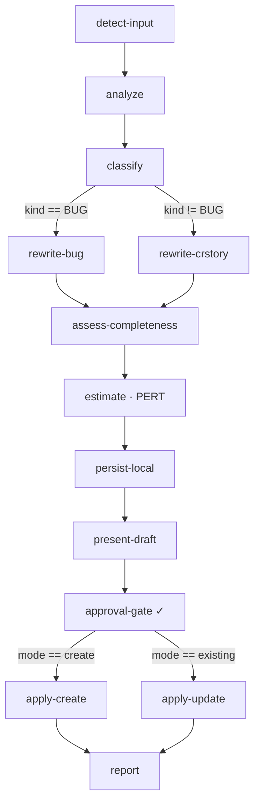

# unic-ticket-specification

A portable Archon workflow that takes a tracker ticket from intake to **"ready for implementation"**
— usable by any Unic project regardless of issue tracker (**Jira / Azure DevOps / GitHub**),
source-control host, number of code repos, or operating system (**Windows / macOS**).

Archon has no marketplace; this plugin rides the Claude Code plugin marketplace. The installable
bundle is the plugin's [`.archon/`](.archon/) directory — copy it into a target project's `.archon/`
to install. See the [bundle README](.archon/unic-ticket-specification.README.md) for per-project
setup.

---

## Workflow



> **✓** = interactive human gate (workflow pauses until human approves or rejects; rejection revises
> and re-presents, up to 3 attempts). Nothing is written to the tracker before this gate.

---

## Node reference

| Node                | Type        | Tracker write | Human gate | Notes                                                  |
| ------------------- | ----------- | ------------- | ---------- | ------------------------------------------------------ |
| detect-input        | prompt      | —             | —          | existing reference vs. free-text new ticket            |
| analyze             | command     | read-only     | —          | fetch + grep across all configured repos + linked docs |
| classify            | prompt      | —             | —          | Bug vs Change-Request/Story (defaults to CR_STORY)     |
| rewrite-bug         | command     | —             | —          | `when` kind == BUG                                     |
| rewrite-crstory     | command     | —             | —          | `when` kind != BUG                                     |
| assess-completeness | prompt      | —             | —          | non-blocking low/medium/high annotation                |
| estimate            | command     | —             | —          | three-point PERT with caveats when completeness < high |
| persist-local       | command     | —             | —          | stable local copy that survives rejection/failure      |
| present-draft       | prompt      | —             | —          | consolidates the proposal for review                   |
| approval-gate       | interactive | —             | ✓          | required before any tracker write; max 3 attempts      |
| apply-create        | command     | **create**    | —          | `when` mode == create                                  |
| apply-update        | command     | **update**    | —          | `when` mode == existing                                |
| report              | prompt      | —             | —          | final reference, URL, issue type, PERT E, open items   |

---

## Quick start

**Step 1 — Configure (recommended: zero-config).** In Claude Code, run:

```
/unic-ticket-specification:setup
```

It auto-detects your tracker from the git remote, asks a few questions, and writes
`.archon/ticket-spec.config.yaml` and `.archon/mcp/ticket-spec-tracker.json` for you — no hand-edited
YAML. It is idempotent: re-run it to fill gaps, pass `reconfigure` to start over, or pass free-form
intent (e.g. "switch tracker to azure-devops") for a targeted tweak.

**Step 2 — Run** it, passing either an existing ticket reference or a free-text description of a new
ticket:

```sh
archon workflow run unic-ticket-specification --input "ACME-1234"
archon workflow run unic-ticket-specification --input "Add a CSV export button to the orders list"
```

### Manual install (alternative)

If you prefer not to use `/setup`: copy this plugin's `.archon/` contents into your project's
`.archon/`, copy `ticket-spec.config.example.yaml` → `.archon/ticket-spec.config.yaml` and fill in
`tracker.type`, the matching tracker block, `repos`, `docs`, and (optionally) `templates`, then
either set `tracker.access.mcp: true` with the right MCP server in
`.archon/mcp/ticket-spec-tracker.json`, or set `tracker.access.mcp: false` and name a CLI
(`jira` / `az` / `gh`) that is installed and authenticated.

Full instructions live in the [bundle README](.archon/unic-ticket-specification.README.md).

---

## How it stays generic

- **No tracker/tenant/repo/OS detail is hardcoded.** It all lives in the per-project config
  `.archon/ticket-spec.config.yaml`.
- **MCP-first, CLI fallback.** Tracker nodes load `.archon/mcp/ticket-spec-tracker.json`; otherwise
  they use the configured CLI.
- **Multi-repo.** `repos:` lists one or many checkouts; analysis greps across all.
- **OS-independent.** Relative, forward-slash paths; no shell- or OS-specific commands.
- **Markdown-only descriptions** so they render across Jira, Azure DevOps, and GitHub alike.

---

## Dependencies

- **Archon workflow engine** in the target project (uses interactive approval gates, `when`
  branches, `output_format`, `mcp`, and `retry`).
- **Tracker access** — one of:
  - an MCP server in `.archon/mcp/ticket-spec-tracker.json` (Atlassian / Azure DevOps / GitHub MCP), or
  - the matching tracker CLI installed + authenticated: `jira` (Jira), `az` with the
    `azure-devops` extension (Azure DevOps), or `gh` (GitHub).
